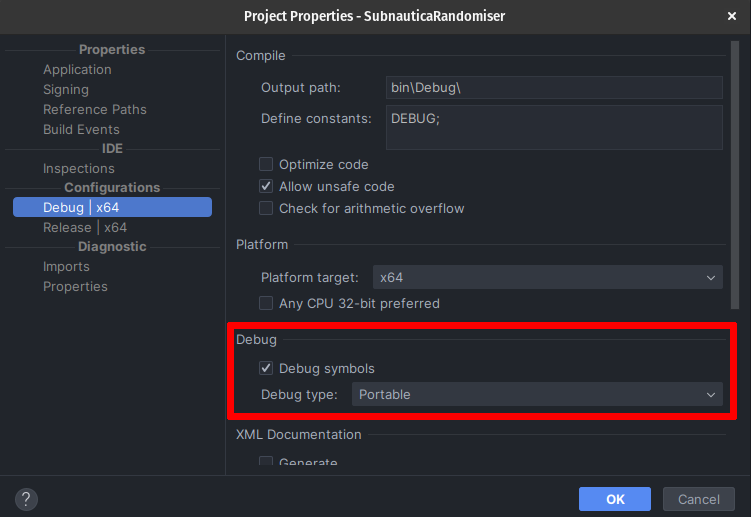
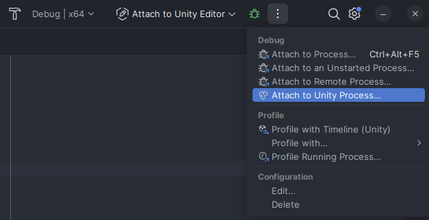

# Setting up Debugging

This guide will show you how to enable advanced tools to make it easier to diagnose errors in your mods.

You should at least be somewhat familiar with modding for this tutorial. It is assumed that you have a development
environment set up with both a Debug and a Release configuration, know basic C#, and have developed your first mod.

> [!NOTE]
> The contents of this guide are not specific to Subnautica and will work for any Unity game as long as a
> version of BepInEx that uses Unity Doorstop 4 is installed (v5.4.23.2+).

## Features and Limitations

Using debug information generated during build, you can:

- Get exact line numbers in exceptions that show up in the log file.
- Attach a debugger to the game.
- Use standard debugging features like breakpoints, executing code one line at a time, and watching what's happening in
  your variables.

However, you cannot:

- Use the above features for code for which you do not have a .pdb file, i.e. any code you did not write yourself.
- In particular, you cannot use this to debug code that is part of Subnautica.

## Generating Debug Symbols

The first step is to make your IDE generate debugging information while it builds your mod. We will do this only for
the Debug configuration, so that you can use Debug for your own testing and Release for sharing your finished mod with
others.

Depending on your IDE the settings will be located in different places.

# [Visual Studio](#tab/vs)

- In the file explorer window on the left, right-click on your project and choose `Properties...`
- At the top of this new popup window, select the `Debug` configuration from the dropdown.
- On the left, navigate to the `Build` submenu.
- Set the `Debug Symbols` dropdown to `Portable`.

# [JetBrains Rider](#tab/rider)

- In the file explorer window on the left, right-click on your project and choose `Properties...`
- Navigate to the `Debug` configuration.
- Tick `Debug Symbols` and set the debug type to `Portable`.

---

Your IDE now generates a {projectname}.pdb file on every build. This file contains all the debug information about your
project. Place this file next to your mod's .dll in the BepInEx/plugins directory so that debugging tools can read it.
It is important that whenever you build a new version of your mod you also remember to update the .pdb file.
Otherwise, the debug information will not line up with your actual code and the debugger will get confused.

> [!TIP]
> To ensure your files are always in sync, use MSBuild's post-build actions to automatically deploy both the .dll and
> the .pdb to your game folder.

## Enabling the Debugging Server

Since version 5.4.23.2, BepInEx ships with Unity Doorstop 4, which provides a built-in debugging server. Navigate to
your Subnautica install directory (the same place as `Subnautica.exe`), where you should find a file called `doorstop_config.ini`. If you do not have this
file, ensure you have the correct version of BepInEx installed.

In `doorstop_config.ini`, do the following:

- Set `debug_enabled` to `true`.
- Take note of the address in `debug_address` for later.
- Optionally, set `debug_suspend` to true. This will force the game to freeze until you attach a debugger. This is useful
  if you need to debug code that executes very early on, before the game even loads into the main menu. If unsure, leave
  this off.

With the debugging server enabled and the information from your .pdb files in the right place,
any exceptions that happen in your mod will now display the correct line numbers, regardless of whether a debugger is
attached.

## Connecting a Debugger to the Debugging Server

# [Visual Studio](#tab/vs)

### Using Visual Studio's built-in Debugger

Visual Studio does not provide support for Unity out of the box. We first need to make sure you have the correct plugin
installed to enable Unity debugging.

- Follow the instructions on [Microsoft's help page](https://learn.microsoft.com/en-us/visualstudio/gamedev/unity/get-started/getting-started-with-visual-studio-tools-for-unity?pivots=windows)
  to install the `Game Development with Unity` workload.
  - You do not need to install Unity itself or the Unity Hub, just the VS workload is enough.
- To make sure you won't have to repeat the following steps every time you want to debug, ensure that in the options
  menu found via the menu bar under `Tools > Options > Tools for Unity > General` the setting `Use saved debug targets`
  is set to `true`.
- In the menu bar at the top of the screen, select `Debug > Attach Unity Debugger`.
- In the new window that pops up, click `Input IP`.
- Enter the address you noted down earlier from the doorstep config. By default, the
  hostname will be 127.0.0.1 and the port 10000.
- Save the connection.

From now on, you can debug your mod at any time by choosing your saved connection from the
`Attach to Unity Player` button with the green play symbol in the top right of your IDE.
Note that you must start Subnautica *first* and then connect the debugger *second*. Start
setting breakpoints, explore your code in real time, and see what your variables are really doing.

Learn more about Visual Studio's debugger and what it can do [in the official docs](https://learn.microsoft.com/en-us/visualstudio/debugger/debugger-feature-tour?view=vs-2022).

# [JetBrains Rider](#tab/rider)

> [!WARNING]
> Debugging with Rider on Windows can show NullReferenceExceptions in the variable debugging view for types which are
> defined in UnityEngine.CoreModule (notably MonoBehaviours!). Sometimes you can still see the contents of every 
> variable of a supposedly "null" MonoBehaviour and set breakpoints as usual, but in our testing this has been
> inconsistent.
>
> This issue was not encountered on Linux, which makes us think it's a problem with Rider itself. As of Rider v2025.1.2,
> the Windows version still has this issue.

### Using Rider's built-in Debugger

- At the top right of your screen next to the green debug icon, click on the More Actions dropdown (indicated by
  three vertical dots) and `Attach to Unity Process...`
  - If these dots are not there for you, you can also find this option in the menu bar under
    `Run > Attach to Unity Process...`
- Click `Add Player Address Manually`.
- Give the connection a name and fill in the address you noted down earlier from the doorstop config. By default, the
  hostname will be 127.0.0.1 and the port 10000.
- Save the connection.

From now on, you can choose your debugging connection and press the green bug icon to start the debugger and connect
to Subnautica at any time. Note that you must start Subnautica *first* and then connect the debugger *second*. Start
setting breakpoints, explore your code in real time, and see what your variables are really doing.

Learn more about Rider's debugger and what it can do [in their docs](https://www.jetbrains.com/help/rider/Debugging_Code.html).

---
