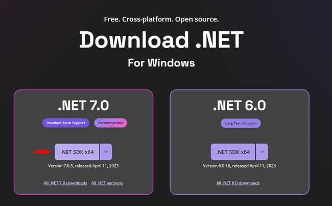
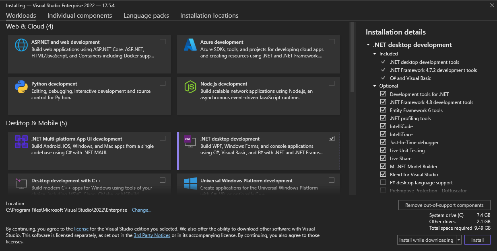
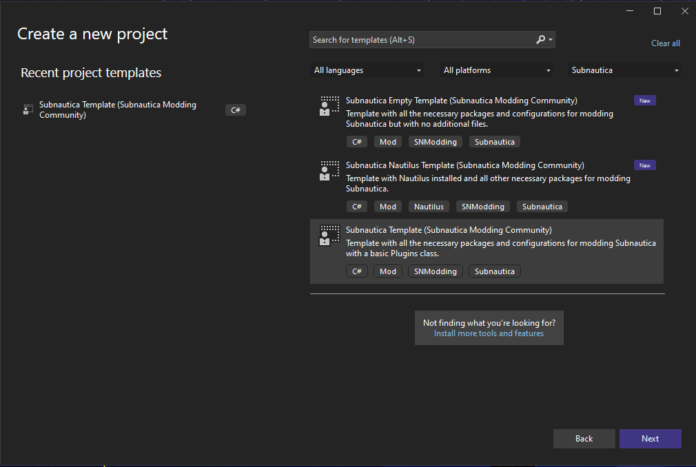

# Development Setup Guide

This article covers a step-by-step guide of setting up your pc for Subnautica mod development. Please note that this setup works on any
operating system, so if you're using a non-windows machine, don't worry! You're in the right place!  

> [!NOTE]
> Although we try to keep this guide as comprehensible as possible, we will not cover a C# tutorial. So a basic understanding of the language
> is still required. [.NET Academy](https://dotnetcademy.net) covers the basics in a simple interactable tutorial.
> If you need a more in-depth C# tutorial, the [Giraffe Academy](https://www.youtube.com/watch?v=GhQdlIFylQ8) video is a good start.

To start developing, you will need to install some tools first:
1. Latest .NET SDK
2. An integrated development environment (IDE)
3. BepInEx 5.4.21
4. Nautilus


## .NET SDK
.NET software development kit (SDK) is the main component of starting to write C# code. The SDK will take care of compiling our code, as well as enable
the latest C# version features.  
In Nautilus we always make sure to update to the latest C# versions. To enable numerous inspection warnings and convenience while working with Nautilus, we recommend you to update the .NET SDK to the latest version.  

> [!TIP]
> Microsoft usually schedules their .NET Core releases around November every year.

To install .NET SDK:
1. Head to the [.NET download page](https://dotnet.microsoft.com/en-us/download)
2. Select the latest recommended .NET SDK  

3. Download and run the installer. A restart may be needed to take place afterward.

To ensure that the SDK has installed correctly, open a terminal and run the following line:
```bash
dotnet --version
```

Output:
```bash
7.0.102
```

## Picking an IDE
The top 3 IDEs for writing C# code are the following:
- [Visual Studio Community](https://visualstudio.microsoft.com/vs/community) - Free, great IDE designed for .NET development (Windows and Mac only)
- [JetBrains Rider](https://www.jetbrains.com/rider) - Paid, outstanding IDE, incredible code-completion and code suggestions with the power of ReSharper, cross-platform
- [Visual Studio Code](https://code.visualstudio.com) - Free, multi-purpose editor, cross-platform, can be used for C# development with plugins.

## Installing IDE

# [Visual Studio Community](#tab/vs)
1. Download the installer from the [Visual Studio download page](https://visualstudio.microsoft.com/vs/community) and run it
2. Inside the Visual Studio installer, ensure the `.NET Desktop Development` component is selected, then proceed with the installation.  


# [JetBrains Rider](#tab/rider)
1. Download the installer from the [JetBrains Rider download page](https://www.jetbrains.com/rider/download/)
2. Run the installer and follow the wizard steps.

# [Visual Studio Code](#tab/vscode)
1. Download the installer from the [VS Code download page](https://code.visualstudio.com/) and run it
2. Install the [.NET extension pack](vscode:extension/ms-dotnettools.vscode-dotnet-pack). This pack includes these extensions:
   - [C# for Visual Studio Code](https://marketplace.visualstudio.com/items?itemName=ms-dotnettools.csharp)
   - [Ionide for F#](https://marketplace.visualstudio.com/items?itemName=Ionide.Ionide-fsharp)
   - [Jupyter Notebooks](https://marketplace.visualstudio.com/items?itemName=ms-toolsai.jupyter)
   - [Polyglot Notebooks](https://marketplace.visualstudio.com/items?itemName=ms-dotnettools.dotnet-interactive-vscode)

You can also install extensions separately.  

---

## Installing BepInEx
BepInEx is a mod loader that we use to load Subnautica mods to the game. We recommend using the [Subnautica BepInEx Pack](https://www.nexusmods.com/subnautica/mods/1108) as it's configured specifically for the game.
The installation process is explained in the provided link.

## Installing Nautilus
1. Download Nautilus from one of [Nexus Mods](https://www.youtube.com/watch?v=dQw4w9WgXcQ), [Submodica](https://www.youtube.com/watch?v=dQw4w9WgXcQ) or [GitHub Releases](https://github.com/SubnauticaModding/Nautilus/releases).
2. Drop and drop the `plugins` folder in the zip file to: `PathToSubnautica\BepInEx\`

## Installing Subnautica Modding templates
Since the project setup can be quite tedious for experienced developers and confusing for new-comers, we have published a series of templates to help you setup your projects more easily.  

To install the template, run the following command in a terminal:
```bash
dotnet new -i Subnautica.Templates
```

Once the install is completed, you will receive an output similar to the message below displaying the process as successful.
```bash
Template Name                             Short Name      Language  Tags
----------------------------------------  --------------  --------  ---------------------------------------------
Subnautica Empty Template                 snmod_empty     [C#]      SNModding/Subnautica/Mod
Subnautica Nautilus Template              snmod_nautilus  [C#]      SNModding/Subnautica/Mod/Nautilus
Subnautica Template                       snmod           [C#]      SNModding/Subnautica/Mod
Subnautica: Below Zero Empty Template     bzmod_empty     [C#]      SNModding/Subnautica: Below Zero/Mod
Subnautica: Below Zero Nautilus Template  bzmod_nautilus  [C#]      SNModding/Subnautica: Below Zero/Mod/Nautilus
Subnautica: Below Zero Template           bzmod           [C#]      SNModding/Subnautica: Below Zero/Mod
```
  

Below is a description of what each of these templates represent:

| Template Name                    | Short Name (ID) | Description                                                                                                                               |
|----------------------------------|-----------------|-------------------------------------------------------------------------------------------------------------------------------------------|
| Subnautica Template              | snmod           | Contains all the essential configurations, dependencies, and a basic `Plugin.cs` with the Logger and harmony patcher.                     |
| Subnautica Empty Template        | snmod_empty     | Contains all the essential configurations and dependencies with no additional files.                                                      |
| Subnautica Nautilus Template     | snmod_nautilus  | Contains all the essential configurations, dependencies with Nautilus installed and a simple example demonstrating the usage of Nautilus. |

The Subnautica: Below Zero templates contain the exact same configurations as their corresponding Subnautica versions, except they install BZ dependencies instead.

## Creating a new mod project
Once you installed the templates, they will appear among other templates in the "Create new project" section of your favorite IDE. 


You can also create the project using CLI:

# [Subnautica](#tab/sn1)
```bash
dotnet new snmod -n MyBeautifulMod
```

Now you can add more code to the project, then build and put the compiled dll in Subnautica/BepInEx/plugins/.

# [Subnautica: Below Zero](#tab/bz)
```bash
dotnet new bzmod -n MyBeautifulMod
```

Now you can add more code to the project, then build and put the compiled dll in SubnauticaZero/BepInEx/plugins/.