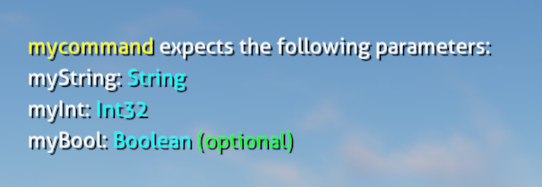

# Adding Custom Console Commands

Nautilus provides a simple API for allowing you to define custom console commands for your mod to respond to when the user types them into the in-game dev console, with simple parameter type checking to enable user- and developer-friendly error reporting, both on-screen and in the log.



## Supported Parameter Types
Currently, only the following types are supported by the API:
- `string`
- `bool`
- `int`
- `float`
- `double`

If you wish to use a type not in this list, it is recommended to use `string` (as that is what the value coming from the user will be anyway) and handle converting and error-checking the value for yourself.  

If the user provides incorrect parameters for a command, they will be notified of the expected parameters on-screen and in the log file.

## Registering a Custom Console Command
There are three ways to register custom console commands, so you can use whichever suits your purpose or coding-style best.

> [!WARNING]
> Registered commands must be unique. If any mod has already added the command, your command will be rejected.

> [!NOTE]
> A command can have a return type, but it is not necessary. If it does return any type, it will be printed on-screen and in the log file.

### Registering a `delegate` (Callback) as a Command
By calling `ConsoleCommandsHandler.RegisterConsoleCommand<T>(string command, T callback)`, you can pass an instance of the delegate, whether it is an anonymous lambda or reference to a method that implements the delegate signature to register your callback as a response to the command.

Note that with a `delegate` command, it is not possible to use optional parameters. 
If you want optional parameters, it is recommended to [register a `public static` method as a command](#registering-a-public-static-method-as-a-command) instead.  

In the example below, we are registering a console command by the use of a delegate. The delegate will respond to the "delegatecommand"
command from the dev console in the game.  

You can also use `System.Func` or `System.Action` delegates to define the signature for your command signature.

```csharp
using BepInEx;
using Nautilus.Handlers;

[BepInPlugin(PluginInfo.GUID, PluginInfo.MOD_NAME, PluginInfo.VERSION)]
public class MyPlugin : BaseUnityPlugin
{
    private void Start()
    {
        ConsoleCommandsHandler.RegisterConsoleCommand<MyCommand>("delegatecommand", (myString, myInt, myBool) =>
        {
            return $"Parameters: {myString} {myInt} {myBool}";
        });
    }

    private delegate string MyCommand(string myString, int myInt, bool myBool);
}
```

The command: `delegatecommand foo 3 true` is a valid signature for the code above. 

### Registering a `public static` Method as a Command
By calling `ConsoleCommandsHandler.RegisterConsoleCommand(string command, Type declaringType, string methodName, Type[] parameters = null)`, you can specify a `public static` method as a response to the command. The API here is similar to Harmony in that it will search for the method in the given type, using the optional `Type[] parameters` to target overloads.  

In the example below, we are registering a console command by specifying a target method. The method will respond to the "methodcommand"
command from the dev console in the game.

```csharp
using BepInEx;
using Nautilus.Handlers;

[BepInPlugin(PluginInfo.GUID, PluginInfo.MOD_NAME, PluginInfo.VERSION)]
public class MyPlugin : BaseUnityPlugin
{
    private void Start()
    {
        ConsoleCommandsHandler.RegisterConsoleCommand("methodcommand", typeof(MyMod), nameof(MyCommand));

        Logger.LogInfo("Patched successfully!");
    }

    public static string MyCommand(string myString, int myInt, bool myBool = false)
    {
        return $"Parameters: {myString} {myInt} {myBool}";
    }
}
```

The command: `methodcommand foo 3 true` is a valid signature for the code above.

### Registering Multiple `public static` Methods Within a Class as Commands
By calling `ConsoleCommandsHandler.RegisterConsoleCommands(Type type)`, you can register all `public static` methods decorated with the `ConsoleCommandAttribute` as console commands.  

In the example below, we are registering all console commands specified in the `MyConsoleCommands` types as console commands.  
Methods decorated with the `ConsoleCommandAttribute` will respond to the specified command from the dev console in the game.

```csharp
using BepInEx;
using Nautilus.Commands;
using Nautilus.Handlers;

[BepInPlugin(PluginInfo.GUID, PluginInfo.MOD_NAME, PluginInfo.VERSION)]
public class MyPlugin : BaseUnityPlugin
{
    private void Start()
    {
        ConsoleCommandsHandler.RegisterConsoleCommands(typeof(MyConsoleCommands));

        Logger.Log(Logger.Level.Info, "Patched successfully!");
    }
}

public static class MyConsoleCommands
{
    /// The MyAttributedCommand method will respond to the "attributedcommand" command from the dev console.
    [ConsoleCommand("attributedcommand")]
    public static string MyAttributedCommand(string myString, int myInt, bool myBool = false)
    {
        return $"Parameters: {myString} {myInt} {myBool}";
    }
}
```

The commands:
- `attributedcommand foo 3 true`
- `attributedcommand foo 3`
are both valid signatures for the code above.

> [!NOTE]
> [Optional arguments](https://learn.microsoft.com/en-us/dotnet/csharp/programming-guide/classes-and-structs/named-and-optional-arguments#optional-arguments) can be ignored when executing a command in the dev console.
> When ignored, the specified default value will be used instead.