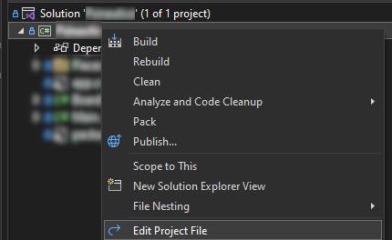

# Customizing your C# project

This page contains several small tutorials for customizing and improving your development environment.

Many sections expect that you have used the mod templates as shown [here](../guides/simple-mod.md).

## Changing Plugin Info

Plugins such as the BepInEx configuration manager and the Subnautica Mod Manager will show users your mod's display name.
Your mod's version may be used for version/dependency checking. Other mods will need to use your mod's GUID for dependencies and compatibility.

All of these values are automatically generated but can be changed by editing your csproj file.



### Changing Plugin Version:

This is generally the easiest property to set because the `Version` tag is already present in the csproj by default.

Example:

```xml
<Version>1.0.0</Version>
```

Please do not use semver here! BepInEx 5 does NOT support semver.

You may also use the `BepInExPluginVersion` tag if you want more control over this.

### Changing Plugin Name:

You must add the `BepInExPluginName` tag to edit the Name. I suggest putting this into the same property group as the Version tag.

Example:

```xml
<BepInExPluginName>Project Neptune</BepInExPluginName>
```

### Changing Plugin GUID:

You must add the `BepInExPluginGuid` tag to edit the GUID. I suggest putting this into the same property group as the Version tag.

Example:

```xml
<BepInExPluginGuid>com.snmodding.projectneptune</BepInExPluginGuid>
```

> [!NOTE]
> For the sake of consistency, we recommend you use reverse-DNS naming for your GUIDs, i.e. "com.authorname.modname`.

## Automatic project building

It is possible to use post-build scripts that automatically place your mod's DLL into the BepInEx plugins folder right after you hit Build.

> [!IMPORTANT]
> If you plan on using GitHub Actions to automate mod builds, or have many contributors with varying operating systems, this is NOT recommended. I can only test this on Windows.
Because of the aforementioned reasons, we do *not* use this in Nautilus. However, it can be very convenient for your own personal projects.

#### Step 1

In the same folder as your csproj, create a file named "GameDir.targets".

This should be the entire contents of the file:

```xml
<?xml version="1.0" encoding="utf-8"?>
<Project xmlns="http://schemas.microsoft.com/developer/msbuild/2003">
	<PropertyGroup>
		<!--If trying to build this project, please make sure the correct directory to your Subnautica folder is listed below:-->
		<GameDir>C:\Program Files (x86)\Steam\steamapps\common\Subnautica</GameDir>
	</PropertyGroup>
</Project>
```

Edit the `GameDir` property's value if needed so the path matches your local Subnautica directory.
If you understand GitHub well enough, I highly recommend adding this file to your project's gitignore.

#### Step 2

Open your csproj file as shown below:


Outside of any PropertyGroups, add the following (the comments are optional!):

```xml
<!--Imports the GameDir.targets file (from the same folder) which should contain the path to the Subnautica directory for the post-build event-->
<Import Project="GameDir.targets" />
```

This basically allows the rest of the csproj file to easily access your GameDir.targets file, and makes the `GameDir` property usable.

#### Step 3

Still in the csproj, add the following outside of any PropertyGroups:

```xml
<!--Defines the PluginsDir property for use in the Post-Build event-->
<PropertyGroup>
	<PluginsDir>$(GameDir)\BepInEx\plugins</PluginsDir>
</PropertyGroup>
```

You shouldn't have to change this.

### Step 4

Finally, once again in the csproj outside of any PropertyGroups, add the following:

```xml
<!--Post-Build event that automatically places your mods folder with the DLL and documentation into your plugins folder as defined in GameDir.targets-->
<Target Name="PostBuild" AfterTargets="PostBuildEvent">
	<Exec Command="copy /Y &quot;$(TargetPath)&quot; &quot;$(PluginsDir)\$(TargetName)&quot;" />
</Target>
```

Make sure a folder exists in the BepInEx/plugins folder with the same name as your mod DLL.

If everything went correctly, upon building your project the DLL should be automatically placed in the correct location, meaning you do not have to manually move the DLL anymore!