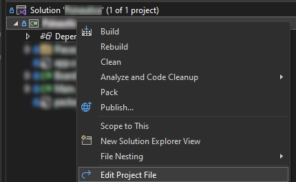

# Customizing your C# project

This page contains several small tutorials for customizing and improving your development environment.

Many sections expect that you have used the mod templates as shown [here](../guides/simple-mod.md).

## Changing Plugin Info

Plugins such as the BepInEx configuration manager and the Subnautica Mod Manager will show users your mod's display name.
Your mod's version may be used for version/dependency checking. Other mods will need to use your mod's GUID for dependencies and compatibility.

All of these values are automatically generated but can be changed by editing your csproj file.



### Changing Plugin Version:

This is generally the easiest property to set because the `Version` tag is already present in the csproj by default.

Example:

```xml
<Version>1.0.0</Version>
```

Please do not use semver here! BepInEx 5 does NOT support semver.

You may also use the `BepInExPluginVersion` tag if you want more control over this.

### Changing Plugin Name:

You must add the `BepInExPluginName` tag to edit the Name. I suggest putting this into the same property group as the Version tag.

Example:

```xml
<BepInExPluginName>Project Neptune</BepInExPluginName>
```

### Changing Plugin GUID:

You must add the `BepInExPluginGuid` tag to edit the GUID. I suggest putting this into the same property group as the Version tag.

Example:

```xml
<BepInExPluginGuid>com.snmodding.projectneptune</BepInExPluginGuid>
```

> [!NOTE]
> For consistency, we recommend you use reverse-DNS naming for your GUIDs, i.e. "com.authorname.modname`.

## Automatic DLL copying

It is possible to use post-build scripts that automatically place your mod's DLL into the BepInEx plugins folder right after you hit Build.

#### Step 1

In the same folder as your csproj, create a file named "GameDir.targets". This file can be named anything, but for the tutorial, we will use this for consistency.

Paste this into the file:

```xml
<?xml version="1.0" encoding="utf-8"?>
<Project xmlns="http://schemas.microsoft.com/developer/msbuild/2003">
	<PropertyGroup>
		<!--If trying to build this project, please make sure the correct directory to your Subnautica folder is listed below:-->
		<GameDir>C:\Program Files (x86)\Steam\steamapps\common\Subnautica</GameDir>
	</PropertyGroup>
</Project>
```

Edit the `GameDir` property's value if needed so the path matches your local Subnautica directory.

It is recommended to add this file to your project's gitignore if this is a shared repository.

#### Step 2

Open your csproj file as shown below:


Outside of any PropertyGroups and ItemGroup, add the following (the comments are optional!):

```xml
<!--Imports the file (from the same folder) that contains the path to the Subnautica directory for the post-build event-->
<Import Project="GameDir.targets" />
```

This imports the content of your GameDir.targets into the csproj, allowing the `GameDir` variable to be used despite being located in another file.

#### Step 3

In the csproj, add the following as a new group:

```xml
<!--Defines the PluginsDir property for use in the Post-Build event-->
<PropertyGroup>
	<PluginsDir>$(GameDir)\BepInEx\plugins</PluginsDir>
</PropertyGroup>
```

You will likely never need to change the csproj to change the copy paths. The only file that may need to be changed is GameDir.targets.

#### Step 4

Finally, once again in the csproj outside of any PropertyGroups, add the following:

```xml
<!--Post-Build event that automatically places your mods folder with the DLL and documentation into your plugins folder as defined in GameDir.targets-->
<Target Name="PostBuild" AfterTargets="PostBuildEvent">
	<MakeDir Directories="$(PluginsDir)\$(TargetName)" />
	<Copy SourceFiles="$(TargetPath)" DestinationFolder="$(PluginsDir)\$(TargetName)" />
</Target>
```

If you want to do the same for a .pdb file, add this to just before `</Target>`:

```xml
<Copy SourceFiles="$(TargetDir)\(TargetName).pdb" DestinationFolder="$(PluginsDir)\$(TargetName)" />
```

Assuming everything was set up correctly: upon building your project, the DLL will be automatically copied to the plugins folder, meaning that you do not have to manually move the DLL anymore!
