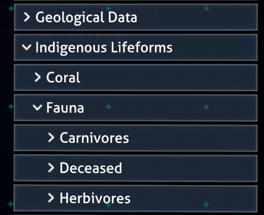
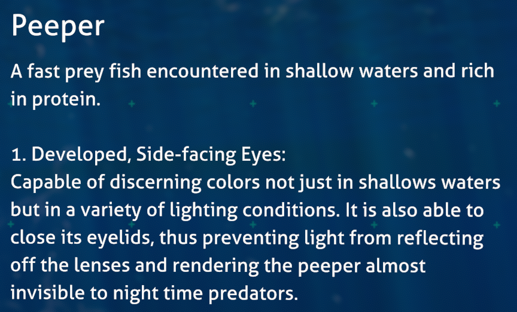
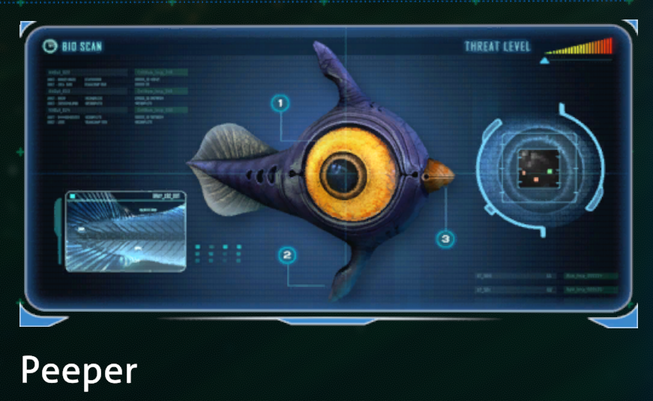
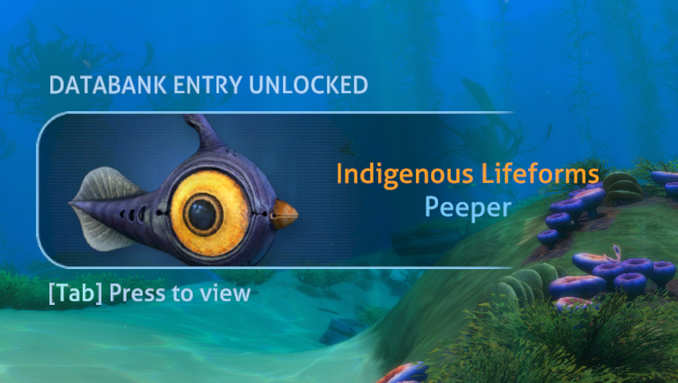
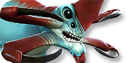

# Adding Custom Databank Entries

> [!IMPORTANT]
> The terms "Databank", "Encyclopedia" and "Ency" are used interchangeably throughout the game, its codebase and in mods. These are *also* referred to as "PDA Entries". Keep all of this in mind!

The PDA’s Databank is essential for providing players with large blocks of text that would otherwise take too long to read. These entries can also contain a custom image or audio file embedded within to enhance the player’s understanding of the information.

It is recommended to set up an Asset Bundle for Databank entries that involve custom assets. Asset Bundles simplify the process of loading assets to one line per call, regardless of file type.

--- 

# Creating a Databank entry through Nautilus

This tutorial will be based around the [PDAHandler.AddEncyclopediaEntry(...)](https://subnauticamodding.github.io/Nautilus/api/Nautilus.Handlers.PDAHandler.html#Nautilus_Handlers_PDAHandler_AddEncyclopediaEntry_System_String_System_String_System_String_System_String_UnityEngine_Texture2D_UnityEngine_Sprite_FMODAsset_FMODAsset_) method.

The method listed above is the easiest and most proper way to register a custom entry to the game through Nautilus. Therefore, the following sections on entry creation will elaborate upon all of the parameters.

Keep in mind that there are also steps beyond creation. For example, your PDA entry must also be unlocked somehow.

### Creating an entry: Key

| Parameter name | Value type | Nullability |
| --------- | ---- | --- |
| `key` | `string` | Essential property; must be assigned a proper value! |

Every PDA Databank entry has its own internal "key", also referred to as an ID, which ensures it is unique and must be used in other systems when applicable. For example, a Story
Goal that unlocks a Databank entry should have the same key/ID as the entry that it unlocks.

### Creating an entry: Path



| Parameter name | Value type | Nullability |
| --------- | ---- | --- |
| `path` | `string` | Essential property; must be assigned a proper value! |

Every PDA entry has its own "path" which determines where in the PDA this entry is found. A typical path looks something like `Lifeforms/Fauna/Leviathans`.

<details>
  <summary>Click here for a list of standard Databank paths</summary>

| Path | Display Name |
| ---- | ------------ |
| `Tech` | Blueprints |
| `Welcome` | Survival Package |
| `Welcome/StartGear` | Additional Technical |
| `Tech/Habitats` | Habitat Installations |
| `Tech/Equipment` | Equipment |
| `Tech/Vehicles` | Vehicles |
| `Tech/Power` | Power |
| `Lifeforms` | Indigenous Lifeforms |
| `Lifeforms/Coral` | Coral |
| `Lifeforms/Fauna` | Fauna |
| `Lifeforms/Flora` | Flora |
| `Lifeforms/Flora/Land` | Land |
| `Lifeforms/Flora/Sea` | Sea |
| `Lifeforms/Flora/Exploitable` | Exploitable |
| `Lifeforms/Fauna/Herbivores` | Herbivores (UNUSED) |
| `Lifeforms/Fauna/Carnivores` | Carnivores |
| `Lifeforms/Fauna/Rays` | Rays |
| `Lifeforms/Fauna/Sharks` | Sharks |
| `Lifeforms/Fauna/Leviathans` | Leviathans |
| `Lifeforms/Fauna/Other` | Other Predators (UNUSED) |
| `Lifeforms/Fauna/SmallHerbivores` | Herbivores - Small |
| `Lifeforms/Fauna/LargeHerbivores` | Herbivores - Large |
| `Lifeforms/Fauna/Scavengers` | Scavengers & Parasites |
| `Lifeforms/Fauna/Deceased` | Deceased |
| `PlanetaryGeology` | Geological Data |
| `Advanced` | Advanced Theories |
| `DownloadedData` | Data Downloads |
| `DownloadedData/BeforeCrash` | Operations Logs |
| `DownloadedData/PublicDocs` | Public Documents |
| `DownloadedData/Degasi` | Degasi Survivors |
| `DownloadedData/Degasi/Orders` | Alterra Search & Rescue Mission |
| `DownloadedData/Lifepods` | CORRUPTED (UNUSED) |
| `DownloadedData/AuroraSurvivors` | Aurora Survivors |
| `DownloadedData/Codes` | Codes & Clues |
| `DownloadedData/Precursor` | Alien Data |
| `DownloadedData/Precursor/Terminal` | Terminal Data |
| `DownloadedData/Precursor/Scan` | Scan Data |
| `DownloadedData/Precursor/Artifacts` | Artifacts |
| `TimeCapsules` | Time Capsules |
</details><br>

You can also create your own paths. When doing this, make sure you set the language line properly. The key for a path in the language system is `EncyPath_{path}`, i.e. `EncyPath_Lifeforms/Fauna/Leviathans`.

#### Example of custom path creation
```csharp
LanguageHandler.SetLanguageLine("EncyPath_Lifeforms/Fauna/Pets", "Pets");
LanguageHandler.SetLanguageLine("EncyPath_Lifeforms/Fauna/Pets/Robotic", "Robotic Pets");

// Adds "Doggo" to the "Pets" category:
PDAHandler.AddEncyclopediaEntry("Doggo", "Lifeforms/Fauna/Pets" ...);
// Adds "Robot Dog" to the "Robotic" category which is a subcategory of "Pets":
PDAHandler.AddEncyclopediaEntry("Robot Dog", "Lifeforms/Fauna/Pets/Robotic" ...);
```

### Creating an entry: Text



| Parameter name | Value type | Nullability |
| --------- | ---- | --- |
| `title` | `string` | Can be null if implementing proper localization. | 
| `desc` | `string` | Can be null if implementing proper localization. |

Adding the text contents is very simple as it is only composed of two strings that must be passed through into method.

As long as the values passed through the `title` and `desc` parameters are valid (not null), the text will be automatically set and should appear properly in-game.

> [!NOTE]
> Consider setting these parameters to null if you are using [JSON-based localization](https://subnauticamodding.github.io/Nautilus/tutorials/localization.html) in your mod.

### Creating an entry: The main image



| Parameter name | Value type | Nullability |
| --------- | ---- | --- |
| `image` | `UnityEngine.Texture2D` | Can safely be left unassigned. |

The `image` of a Databank entry is its primary visual element. Each entry can have up to one image.

#### Creating your own image assets:

You can make your own Databank images, but it is recommended that you are consistent with the vanilla style of the game. Photoshop is recommended, as it was used to
make these originally, but any image editor can work.

These tend to use the Agency FB font. Stock images are often used in the "close up" areas. A blank template for these is provided below:


> [!IMPORTANT]
> Please keep in mind that it is **ILLEGAL** to use Subnautica's art assets and style in other contexts. However, Unknown Worlds Entertainment has given modders permission to modify their assets for non-commercial purposes within Subnautica mods.

### Creating an entry: Popup image



| Parameter name | Value type | Nullability |
| --------- | ---- | --- |
| `popupImage` | `UnityEngine.Sprite` | Can safely be left unassigned. Uses a default image. |

The popup image is a rather insignificant image that can be applied to your Databank entries. This small image appears to the left side of the screen for a few seconds
when your entry is unlocked.

#### Creating your own popup images:

These images should follow the rules below:
- Typically 256x128 pixels.
- The image is usually cropped so only a decent portion of the render fits in the space.
- The contents NEVER extend to the rightmost side of the image.
- The contents typically do not extend to the left side of the image.
  - If nearing the left side, the leftmost corners must always be cut out.

This image can be used as a template for cutting out the corners:

 

A complete popup image looks like this:



### Creating an entry: Unlock sound

| Parameter name | Value type | Nullability |
| --------- | ---- | --- |
| `unlockSound` | `FMODAsset` | Can safely be left unassigned, but will be automatically resolved to the default sound. |

By default the `unlockSound` parameter is null. This will be automatically resolved to
[PDAHandler.UnlockBasic](https://subnauticamodding.github.io/Nautilus/api/Nautilus.Handlers.PDAHandler.html#Nautilus_Handlers_PDAHandler_UnlockBasic).
While you can technically use any sound asset, the only other recommended sound is
[PDAHandler.UnlockImportant](https://subnauticamodding.github.io/Nautilus/api/Nautilus.Handlers.PDAHandler.html#Nautilus_Handlers_PDAHandler_UnlockImportant).

### Creating an entry: Voice logs


| Parameter name | Value type | Nullability |
| --------- | ---- | --- |
| `voiceLog` | `FMODAsset` | Can safely be left unassigned. |

Audio logs must first have their sounds be registered through the `CustomSoundHandler` class. The
[overload that takes an AudioClip](https://subnauticamodding.github.io/Nautilus/api/Nautilus.Handlers.CustomSoundHandler.html?q=custom%20sound%20ha#Nautilus_Handlers_CustomSoundHandler_RegisterCustomSound_System_String_UnityEngine_AudioClip_FMOD_Studio_Bus_)
is recommended due to its simplicity, but anything should work. Also, remember to use the `AudioUtils.BusPaths.VoiceOvers` bus.

After registering a sound, you must make an FMODAsset. An FMODAsset essentially acts as a container for your sound path. To create one use the
[AudioUtils.GetFmodAsset(string)](https://subnauticamodding.github.io/Nautilus/api/Nautilus.Utility.AudioUtils.html?q=fmod#Nautilus_Utility_AudioUtils_GetFmodAsset_System_String_System_String_)
method, where the `path` is the ID that you just defined in the CustomSoundHandler.

Finally, just pass this FMODAsset into the `voiceLog` parameter of the original method.

### Creating an entry: Examples

#### Example 1

Registers a new PDA entry with a large image, popup image and proper title/description.

```csharp
// "EldritchLogImage" is the name of the image file in the asset bundle. remember to omit file extensions.
Texture2D eldritchImage = assetBundle.LoadAsset<Texture2D>("EldritchLogImage");

// remember: popup images must be imported as a sprite.
Sprite eldritchPopup = assetBundle.LoadAsset<Sprite>("EldritchLogSprite");

// description string (does not need a variable of its own):
string eldritchDesc = "There weren't enough lifeboats, I took the only one for myself.";

// register the encyclopedia entry into the game:
PDAHandler.AddEncyclopediaEntry("EldritchLog", "DownloadedData/PublicDocs", "Eldritch's Log", eldritchDesc, eldritchImage, eldritchPopup, null);
```

#### Example 2

Registers a new PDA entry with a voice log, popup image and proper title/description.

```csharp
// remember: popup images must be imported as a sprite.
Sprite popupLee = assetBundle.LoadAsset<Sprite>("LeeLogSprite");

// register the sound for FMOD.
// the sound's ID can be anything, as long as it corresponds with the FMOD asset.
CustomSoundHandler.RegisterCustomSound("LeeAudioLog", assetBundle.LoadAsset<AudioClip>(), AudioUtils.BusPaths.VoiceOvers);

// create an FMOD asset, which must have the same ID as the sound.
// all this does is act as a container for the sound's ID, but it is required for the encyclopedia entry.
FMODAsset leeLogSound = AudioUtils.GetFmodAsset("LeeAudioLog");

// passed into the subtitles and PDA entry description
string transcript = "Hello? Hello? Anyone there? Oh... this isn't a radio, it's just an old voice recorder. Day 32 of being lost at sea. Or was it 33...? Getting lonely.";

// add the translation for the subtitles:
LanguageHandler.SetLanguageLine("LeeAudioLog", transcript);

// register the encyclopedia entry into the game:
PDAHandler.AddEncyclopediaEntry("LeeLog", "DownloadedData/PublicDocs", "Lee's Log", transcript, null, popupLee, leeLogSound);
```

---

# Making entries unlockable

> [!TIP]
> The `ency [key]` command can be used to instantly unlock a Databank entry for testing purposes.

PDA entries are not unlocked by default, but there are various ways to add them to the player’s databank. Some methods are listed below:

| Method | Notes |
| --- | --- |
| Story Goal completion | Only occurs when GoalType is `GoalType.Encyclopedia`. See our [documentation on the StoryGoalHandler class](story-goals.md) for more info. |
| `PDAEncyclopedia.AddAndPlaySound(string key)` | Adds the entry with the given `key`, shows a notification, and plays the correct sound (if defined) for this entry. |
| `PDAEncyclopedia.Add(string key, bool verbose)` | Adds the entry with the given `key`, and shows a notification if `verbose` is true. |

### Example for unlocking with Story Goals:

```csharp
// Register encyclopedia entry like usual:
PDAHandler.AddEncyclopediaEntry("SpadefishHate", "Advanced", "Spadefish are terrible", "Why do they lay eggs? Why do they damage your seamoth so heavily?");

// Use the StoryGoalHandler to make it unlockable.
// This particular example uses the RegisterItemGoal method to unlock the encyclopedia entry when picking up a Spadefish:
StoryGoalHandler.RegisterItemGoal("SpadefishHate", Story.GoalType.Encyclopedia, TechType.Spadefish);
```