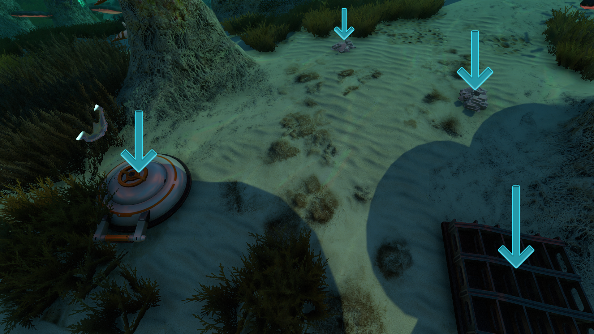
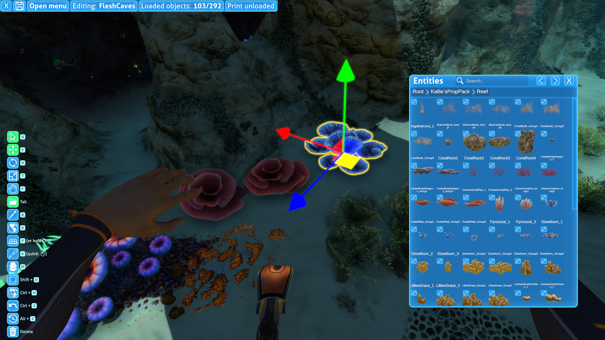

# Loading and Instantiating Prefabs

In Subnautica, objects are created constantly. Creatures and fragments spawn randomly in the ocean. Titanium and other ores appear when outcrops are broken.
Vehicles are physically constructed when crafted. Entire biomes load in when you get close enough. But how exactly is this done, and how can you recreate this in your own mods?

There are countless ways to spawn prefabs into the world, including obscure methods that are beyond the scope of this guide. Each method has its ups and downs,
so it's helpful to be familiar with all of the common approaches.

## Instantiation

---

Instantiation is the process of copying a prefab and spawning it into the active scene (i.e., the world). To instantiate a prefab, use the [Object.Instantiate](https://docs.unity3d.com/6000.5/Documentation/ScriptReference/Object.Instantiate.html) method provided by Unity.

> [!IMPORTANT]
> If you are accessing a prefab for reference purposes (like reusing its materials for another prefab), then you should NOT instantiate it. Instead, directly access the prefab that was loaded *without* calling the Instantiate method. This works perfectly fine. You should only Instantiate prefabs that you want to physically appear in the world.

Some prefabs (particularly modded prefabs) may be inactive by default, so it is suggested to call `SetActive(true)` on newly instantiated GameObjects. If you want to safely instantiate something as deactivated without it initializing for a single frame, you must use `UWE.Utils.InstantiateDeactivated`.

## Common Solutions

---

This section covers common solutions for loading and instantiating prefabs that may require minimal or no custom code, to help avoid reinventing the wheel.

### Loot Distribution System

The [Loot Distribution system](https://subnauticamodding.github.io/Nautilus/tutorials/spawns.html) is used for spawning fragments, creatures, and resources. Modded entities can still spawn in pre-existing saves, but only in regions that have not yet been loaded.


*An example of various entities spawned through the Loot Distribution system.*

### The Mod Structure Helper and Coordinated Spawns

Many mods use the [Mod Structure Helper](https://www.nexusmods.com/subnautica/mods/1665) to place a large number of entities into the world of Subnautica. This tool is usually used in tandem with the Epic Structure Loader or custom logic to register the `.structure` files so they can be automatically loaded for users.

This method does not require any code and is very safe with a low chance of duplication, stray entities, etc. It uses the Coordinated Spawns system under the hood.


*The Mod Structure Helper interface.*

### Prefab Placeholder Groups

The `PrefabPlaceholder` and `PrefabPlaceholdersGroup` components are used by the game to spawn child prefabs within other prefabs. A major example is Degasi bases: when they are first loaded, these bases will manage their own spawning of loot, such as the alien tablets, which stay parented. However, this is only very convenient for mods that are heavily made within the Unity Editor, particularly those using Thunderkit.

## Asynchronously Loading Prefabs

---

Both SN1 and Below Zero use **asynchronous** prefab loading. Therefore, prefab loading must always be handled within [coroutines](https://docs.unity3d.com/6000.5/Documentation/Manual/Coroutines.html), because the loading can occur across multiple frames.
Please note that this is not a guide on coroutines; they have been extensively explained online.

Also, take note of the `UWE.CoroutineHost.StartCoroutine(IEnumerator)` method. This amazing utility method provided by Subnautica lets you execute a coroutine
at any point in your mod, without needing your own MonoBehaviour to host it.

## Manually Loading Prefabs

This section lists common C# methods and examples of how to use them to spawn any prefabs arbitrarily at runtime.

---

### CraftData.GetPrefabForTechTypeAsync

```csharp
public static CoroutineTask<GameObject> GetPrefabForTechTypeAsync(TechType techType, bool verbose = true)
```

This is arguably the most simple way of loading prefabs. This method only takes a TechType and returns a coroutine task.

A coroutine task holds a reference to the prefab once it is complete. However, it will not be loaded instantly. You must write `yield return task` to await its
completion. Only then can you safely call its `GetResult()` method.

Example code that spawns a Peeper in front of the player:
```csharp
private static IEnumerator SpawnPeeper()
{
    // Fetch the prefab:
    CoroutineTask<GameObject> task = CraftData.GetPrefabForTechTypeAsync(TechType.Peeper);
    // Wait for the prefab task to complete:
    yield return task;
    // Get the prefab:
    GameObject prefab = task.GetResult();

    // Instantiate the prefab with a random rotation 2 meters in front of the player camera:
    GameObject.Instantiate(prefab, MainCamera.camera.transform.position + (MainCamera.camera.transform.forward * 2), Random.rotation);
}
```

Bare minimum code with inferred typing:
```csharp
private static IEnumerator SpawnPeeper()
{
    var task = CraftData.GetPrefabForTechTypeAsync(TechType.Peeper);
    yield return task;
    var prefab = task.GetResult();
}
```

---

### UWE.PrefabDatabase.GetPrefabAsync

```csharp
public static IPrefabRequest GetPrefabAsync(string classId)
```

Instead of a TechType, this method requires a Class ID. While some prefabs have TechTypes, almost every prefab has a Class IDs. Of course, there are exceptions.
Certain visual effects and projectiles do not have Class IDs. Special "scene objects" such as the player, Aurora and Cyclops are also unable to be spawned in this way.

The downside of this method is that the Class IDs are not part of the game's assemblies like TechTypes are. This means you must find the Class ID yourself and the
compiler will not autocomplete them for you.

For your convenience, a list of all Class IDs can be found [here](https://github.com/SubnauticaModding/Nautilus/blob/master/Nautilus/Documentation/resources/SN1-PrefabPaths.json).

Example code that spawns a Peeper behind the player:
```csharp
using UWE;
// ...
private static IEnumerator SpawnPeeper()
{
    // Fetch the prefab (3fcd548b-781f-46ba-b076-7412608deeef is the Class ID of the Peeper):
    IPrefabRequest task = UWE.PrefabDatabase.GetPrefabAsync("3fcd548b-781f-46ba-b076-7412608deeef");
    // Wait for the prefab task to complete:
    yield return task;
    // Get the prefab:
    task.TryGetPrefab(out GameObject prefab);

    // Instantiate the prefab with a random rotation 2 meters behind the player camera:
    GameObject.Instantiate(prefab, MainCamera.camera.transform.position - (MainCamera.camera.transform.forward * 2), Random.rotation);
}
```

Bare minimum code with inferred typing:
```csharp
private static IEnumerator SpawnPeeper()
{
    var task = UWE.PrefabDatabase.GetPrefabAsync("3fcd548b-781f-46ba-b076-7412608deeef");
    yield return task;
    task.TryGetPrefab(out var prefab);
}
```

---

### UWE.PrefabDatabase.GetPrefabForFilenameAsync

```csharp
public static IPrefabRequest GetPrefabForFilenameAsync(string filename)
```

This method is similar to `PrefabDatabase.GetPrefabAsync` but takes a file path as opposed to a Class ID.

The [Class ID list](https://github.com/SubnauticaModding/Nautilus/blob/master/Nautilus/Documentation/resources/SN1-PrefabPaths.json)
also contains the file path of every prefab on the right side. Make sure to include the `.prefab` extension and exclude the `Assets/AddressableResources/` prefix.

Example code that spawns a Peeper above the player:
```csharp
using UWE;
// ...
private static IEnumerator SpawnPeeper()
{
    // Fetch the prefab:
    IPrefabRequest task = UWE.PrefabDatabase.GetPrefabForFilenameAsync("WorldEntities/Creatures/Peeper.prefab");
    // Wait for the prefab task to complete:
    yield return task;
    // Get the prefab:
    task.TryGetPrefab(out GameObject prefab);

    // Instantiate the prefab with a random rotation 2 meters above the player camera:
    GameObject.Instantiate(prefab, MainCamera.camera.transform.position + (MainCamera.camera.transform.up * 2), Random.rotation);
}
```

Bare minimum code with inferred typing:
```csharp
private static IEnumerator SpawnPeeper()
{
    var task = UWE.PrefabDatabase.GetPrefabForFilenameAsync("WorldEntities/Creatures/Peeper.prefab");
    yield return task;
    task.TryGetPrefab(out var prefab);
}
```

---

## When to Use Each Method

For many mods, `CraftData.GetPrefabForTechTypeAsync(TechType)` can be the only thing you use. TechTypes are convenient and readable, and most functional prefabs have one.

`PrefabDatabase.GetPrefabAsync` and `PrefabDatabase.GetPrefabForFilenameAsync` can be used interchangeably. The former generally takes up less space in terms of characters.
However, full prefab paths are far more readable than Class IDs. Whichever you want to use is up to you; there is no functional difference.
